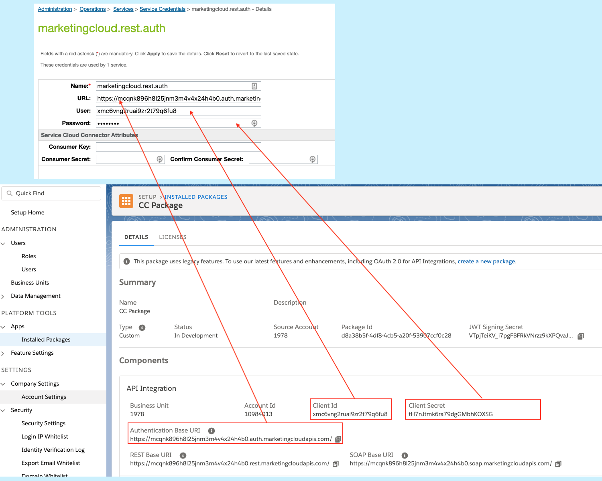

# marketing-cloud-connector

### Navigation
1. [Project Overview](1_0_Project_Overview.md#navlink)
2. [Install Commerce Cloud Components](2_0_Commerce_Cloud_Component_Installation.md#navlink)
	
	2.1 [Handler Framework Installation](2_1_Handler-Installation.md#navlink)
	
	2.2 [**Marketing Cloud Cartridge Installation**](2_2_MarketingCloudCart.md#navlink)
	
	2.3 [SFRA Modification Instructions](2_3_Modification-Instructions-for-SFRA.md#navlink)
	
	2.4 [SiteGenesis Modification Instructions](2_4_Modification-Instructions-for-SiteGenesis.md#navlink)		
	
	2.5 [Manual Modification Instructions](2_5_ManualModifications.md#navlink)

7. [Install Marketing Cloud Components](3_0_ModifyMarketingCloud.md#navlink)

	3.1 [Triggered Send and Transactional Emails](3_1_0_TriggeredSendTransactionalEmails.md#navlink)
	
	3.1.1 [Triggered Send Configuration](3_1_1_MCConnectorInstallation-TriggeredSendConfiguration.md#navlink)
	
	3.2 [Realtime Analytics Configuration](3_2_MCConnectorInstallation-RealtimeAnalyticsConfiguration.md#navlink)
	
11. [Additional Features](4_0_AdditionalFeatures.md#navlink)
12. [Debugging](5_0_Debugging.md#navlink)

## 2.2 Marketing Cloud Cartridge Installation

## Metadata and Cartridge Installation 

Ensure that the Handler Framework has been installed correctly and your storefront code has been adjusted accordingly.

See the [Handler Framework Cartridge Installation](https://github.com/SalesforceCommerceCloud/marketing-cloud-connector/docs/Handler-Installation.md#navlink) if necessary.

1. Check out the latest tagged release from the [Marketing Cloud Connector Github Repository](https://github.com/SalesforceCommerceCloud/marketing-cloud-connector).

2. Add the `int_marketing_cloud` directory to your storefront cartridges, and upload the cartridge to your Commerce Cloud storefront instance.

3. Import metadata, jobs, services, and custom objects from the `/sites/site_template/` directory.

	The custom object definitions for `MarketingCloudDataExport` and `MarketingCloudTriggers` are set to site-level by default to support different configurations per site. If you are using the same configuration for your entire organization, you can change the site-level custom objects to organization-level custom objects. 
	
	To do so:
	
    1. Open `marketing-cloud-connector/sites/site_template/meta/custom-objecttype-definitions.xml`.
    2. Change `<storage-scope>site</storage-scope>` to `<storage-scope>organization</storage-scope>` for each object type that is intended to be global.
    3. Save, and import the definition file.
    
4. Update your site cartridge path:
`app_storefront_controllers:app_storefront_core:int_marketing_cloud:int_handlerframework`

## Commerce Cloud : Service Configuration 

Within Commerce Cloud Business Manager, update the services that have been imported into Commerce Cloud using the provided XML files.

If you have multiple Commerce Cloud sites and connect a single site to a single business unit, create a separate service cedential for each site, repeating the steps described below. 

1. In Business Manager, go to **Administration > Operations > Services**, and click the **Creditials** tab.

	**Note**: If you have multiple sites in Commerce Cloud but intend to only use one Marketing Cloud business unit, you can modify the `marketingcloud.rest.auth` service credential directly.

2.  Click **New**, and create a new service credential based on `marketingcloud.rest.auth`.

	1. Append your own Business Manager Site ID to the Credential Name (for example, `marketingcloud.rest.auth-SiteGenesis`).
	2. Enter the URL.
	3. Populate the User ID field with your own API User ID, also called the Client ID, from Marketing Cloud.
	4. Populate the Password field with your own API password, also called Client Secret, from Marketing Cloud.
	5. Click **Apply**.

	
	
3. Click the **Services** tab, and click the new service.
	
	If you're modifying `marketingcloud.rest.auth` directly, click that.

4. Verify the Credentials dropdown to match the credentials you saved. 

	If you have multiple sites or credentials, the cartridge attempts to switch to site-specific credentials if the assigned credentials aren't site-specific.  It then reverts to the default assigned credentials if it can't find site-specific credentials.

5. Click **Apply**.

## Commerce Cloud : Custom Object Configuration 

1. In Business Manager, go to **Merchant Tools > Custom Objects > Custom Objects Editor**.
2. Select **CommunicationHandlers** from the Object Type dropdown, and click **Find**.
3. Click the **development** instanceType to edit the object.
	
	A JSON object with top-level properties of `standard_email` and `int_marketing_cloud` displays.
	
	Each top-level property contains a list of hooks (each of which can be enabled or disabled), followed by an `enabled` property to turn the entire section either on or off.
	
	1. Update the JSON object's `enabled` properties as desired. 
		
		If you allow two handlers to have the same hook enabled, the first executed hook that returns a value succeeds.
		
		**Note**: The order of execution depends on cartridge path priority. The lookup path is cartridge location in path, followed by hook definition, followed by the enabled property.
		
	2. Click **Apply**.
		
4. From the Object Type dropdown, select **MarketingCloudTriggers**, and click **Find**.

	1. Edit each hook as necessary. 
	
		Each trigger has a trigger key that maps to Marketing Cloud. Each trigger can be directly enabled or disabled. Additionally, a list of Subscriber Attributes has been defined, which is a mapping of available values from Commerce Cloud to the attribute key they should be sent as to Marketing Cloud.
		
		See [3.1.1  Marketing Cloud - Triggered Send Configuration](3_1_1_MCConnectorInstallation-TriggeredSendConfiguration.md#navlink) for additional information. 
		
	2. Click **Apply**.

## Site Preferences

**Name**|**What it does**|**Default Value**
-----|-----|-----
Marketing Cloud Enable Analytics|Select Yes to enable Marketing Cloud Analytics tracking. Requires Member ID to be set.|Yes
Marketing Cloud Member ID|Marketing Cloud Business Unit Member ID, also called MID.| 
Marketing Cloud Include Tracking Link|Select Yes to output the Marketing Cloud Analytics tracking link to the storefront. Requires Member ID to be set.|Yes
Marketing Cloud collect.js URL|Marketing Cloud collect.js URL. The string MCMID must exist in the URL to insert the Marketing Cloud MID into the URL.|//MCMID.collect.igodigital.com/collect.js
Marketing Cloud Enable Mailing List Hooks|Select Yes to enable Marketing Cloud mailing list functionality.|Yes
Marketing Cloud Default Mailing Lists|Default Marketing Cloud mailing lists to assign when a customer subscribes. Provide the numeric List ID value.| 
Marketing Cloud Mailing Lists Whitelist|Whitelist of Marketing Cloud mailing lists. If left empty, all lists are listed for customer. Please provide the numeric "List ID" value.| 
Marketing Cloud Allow Unsubscribing from Lists over Deletion|This flag allows the Marketing Cloud cartridge to unsubscribe users from assigned mailing lists, thus updating the subscriber's status from Active to Unsubscribed. This process is used in place of fully deleting the record from the list.|No

## Apply Modifications to Storefront

Your storefront modifications will vary depending on the reference architecture that you're using. 

If you're building for an SFRA-based storefront, see:

[2.3 Modification Instructions for SFRA](2_3_Modification-Instructions-for-SFRA.md
)

If you're building for a SiteGenesis-based storefront, see:

[2.4 Modification Instructions for SiteGenesis](2_4_Modification-Instructions-for-SiteGenesis.md#navlink)

- - -

[Back to the top](#Top)

